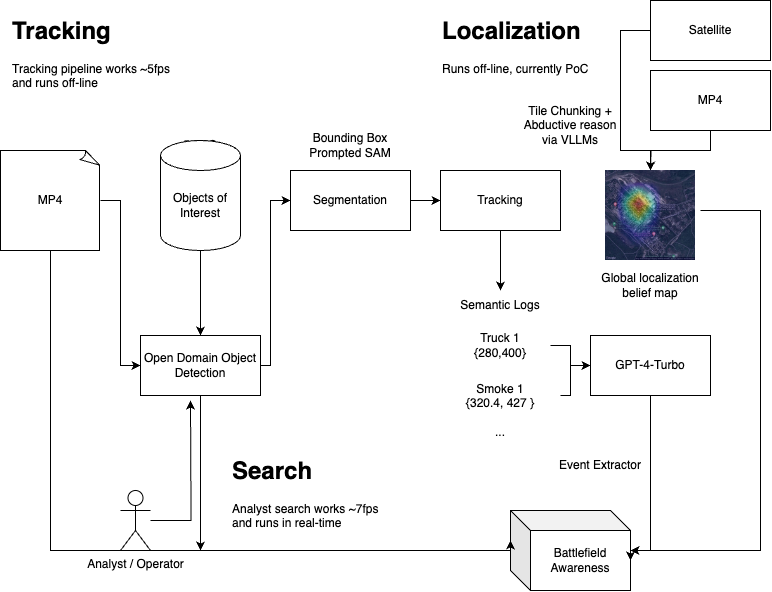

# Overwatch

## Systems Diagram



## UAVInference

This module takes in a list of environment states (with descriptions of the objects in the world), and outputs an array of strings that serve as a log of the events that have transpired throughout the video.

If a significant event happens (i.e. a new object enters the scene, an existing object is destroyed, etc.) the model will reason about the event that has happened based on the metadata for the video, and append an event entry to a JSON log.

This tool will help intelligence analysts understand the events that have transpired during a drone video of a warzone and help them be able to make critical decisions better.

Usage:

Navigate to the directory containing this README file. First, install all dependencies in a Python 3.10 environment as follows:

```
poetry install --no-root
poetry shell
```

Once this has been done, you may run the model inference pipeline on any JSON metadata output from a video as follows:

```
python -m src.pipeline {PATH_TO_FILE}
```

Make sure to replace {PATH_TO_FILE} with the relative path to the desired JSON file.
