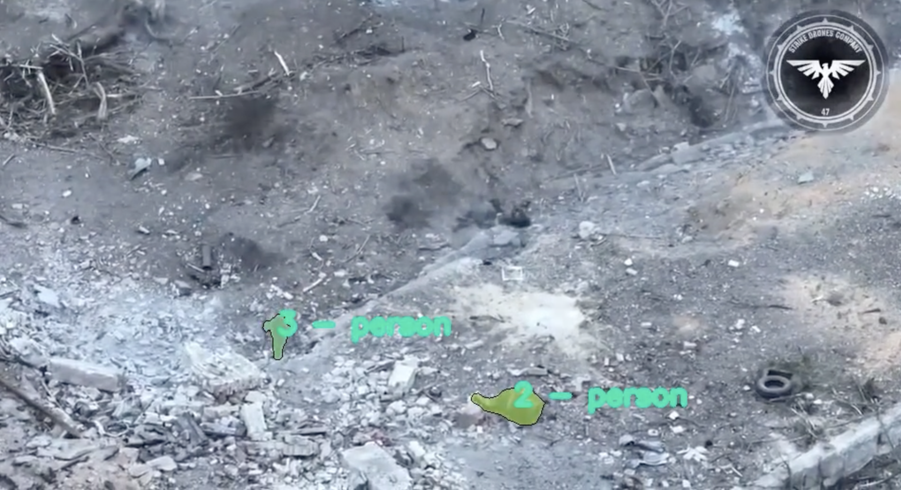
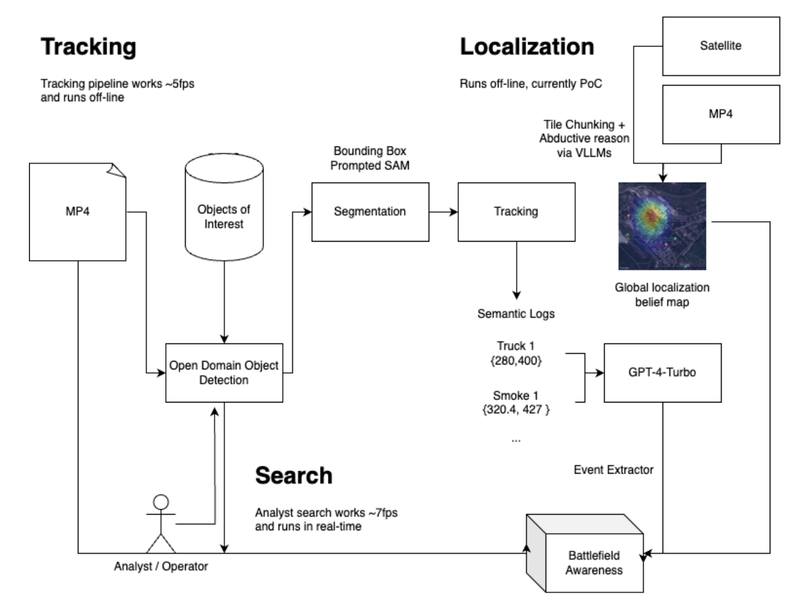

# Overwatch
Parse through thousands of hours of video logs to find enemy combatants, equipment, and risks




## Demo
 - [Watch the hackathon live demo](https://twitter.com/AlexReibman/status/1787643784366616773)
 - [Youtube demo](https://youtu.be/S2ik-Iu8BwY)

## Systems Diagram



## Segmentation inference

The segmentation script exists in the `intel/` directory. `demo_inst.py` script can be run with the `VIDEO` and `CAPTION` environment variable, the former of which points to
`intel/assets/{VIDEO}.mp4`.

The following metadata will be generated from the script which can be used by downstream processes:
 - `intel/assets/output/{VIDEO}_{CAPTION}_output.pkl` which contains the json semantic logs, later processed by UAVInference
 - `intel/assets/output/{VIDEO}_{CAPTION}_masks.npy` which contains the masks for all of the segmentations that were performed.

## UAVInference

This module takes in a list of environment states (with descriptions of the objects in the world), and outputs an array of strings that serve as a log of the events that have transpired throughout the video.

If a significant event happens (i.e. a new object enters the scene, an existing object is destroyed, etc.) the model will reason about the event that has happened based on the metadata for the video, and append an event entry to a JSON log.

This tool will help intelligence analysts understand the events that have transpired during a drone video of a warzone and help them be able to make critical decisions better.

Usage:

Navigate to the directory containing this README file. First, install all dependencies in a Python 3.10 environment as follows:

```
poetry install --no-root
poetry shell
```

Then, in the root directory, create a file named `.env` and deposit your OpenAI API key there as follows:

```
OPENAI_API_KEY="YOUR_API_KEY_HERE"
```

Once this has been done, you may run the model inference pipeline on any JSON metadata output from a video as follows:

```
python -m src.pipeline {PATH_TO_FILE}
```

Make sure to replace {PATH_TO_FILE} with the relative path to the desired JSON file.

## Backend Server

In order to run the backend server, run the `intel/server.py` script which will create a fastAPI server with a websocket endpoint. The following routes can be expected at the following address: `0.0.0.0:8080`

 - `/metadata?video_name={VIDEO_NAME}` - retrieve metadata given video name
 - `/video?video_name={VIDEO_NAME}` - uploads a video (then retrieves the analytics package saved on the server side file system from preprocessing pipeline)
 - `/ws?target_video={VIDEO_NAME}&query={semantic search query}&interval=5` - A websocket endpoint to stream back bounding boxes in real time every `interval` frames
